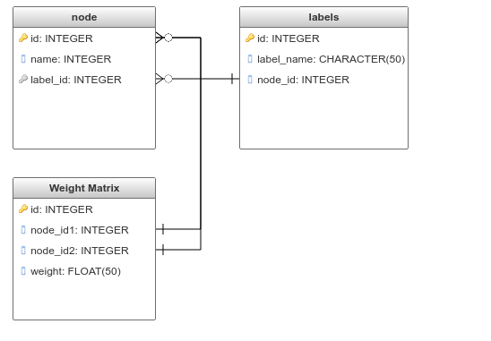

Competitive Collaboration Algorithm:

It's a decentralized network where you compete to collaborate.

https://technoperiod.blogspot.com/2018/10/the-competitive-collaboration-algorithm.html

Edge weight represents difficulty to get connected. Difficulty depends on factors such as distance, location, quality, price.

We need to choose subgraph containing all the required nodes (e.g. nodes containing a,b,c,d ) that has a minimum weight or optimal weight.

a,b,c,d can represent different services, whereas a1, a2 represents the same services from a different service provider.

For example,

'a' can represent a teacher, 'b' can represent a student, 'c' can represent content provider such as a biology textbook and 'd' can represent a classroom or building.

Similarly  'a1' represents teacher1, 'a2' represents teacher2, etc.

Usefulness of the model:

1) Prediction: One can make a prediction using the model, to select the best subgraph or services for an individual.

2) Equal chance to everyone: Its fairer and everyone can get an equal chance to reach their goals.  It will bring competition for quality. Equal chance means many selected subgraphs for many individual will have similar weight, the possibility of getting similar weight increases when we increase the nodes.

3) Continuous Improvement: If any single subgraph, even a node of subgraph gets upgraded and refined, it builds a pressure on other subgraph and nodes to upgrade through competition.

4) No burnouts: Nodes shall not suffer from burn out problems as there is a division of work and a division of labor.

There can be different kinds of weight matrix such as price weight matrix, distance weight matrix and quality weight matrix.
